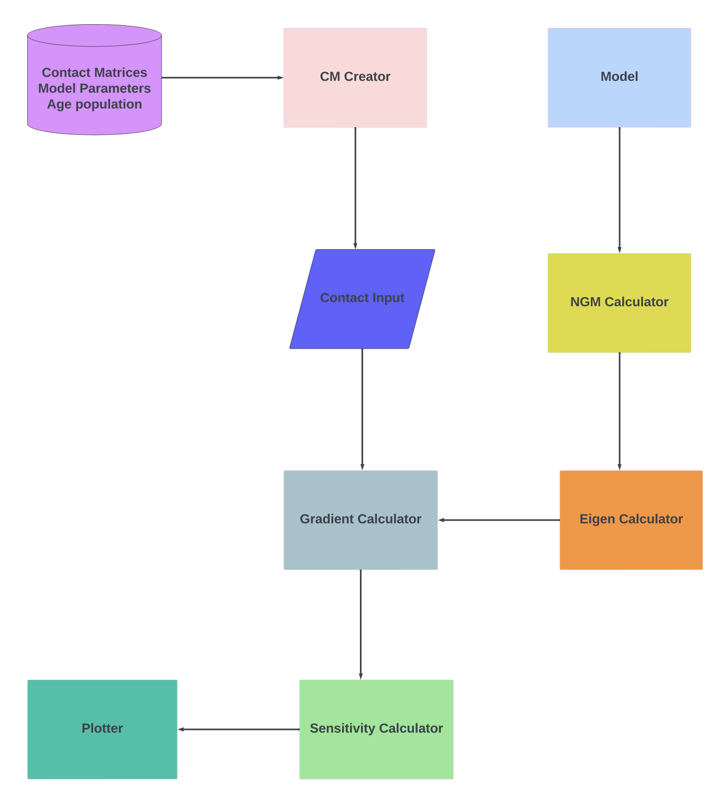

# Sensitivity Analysis of COVID-19 Transmission Dynamics in Hungary: Understanding Infection Acquisition Patterns.

## Introduction
This repository explores age-related variations in virus transmission through perturbation analysis of the 
Next Generation Matrix (NGM) within an age-structured epidemic model. By solving a linear eigen-problem and 
analyzing how the basic reproduction number,R<sub>0</sub>, responds to change in the contact matrix, 
we compute gradients that help identify critical age-specific contact behaviors and susceptibility factors.

## Key Investigation
- **NGM Analysis**: Assessing the impact of perturbations in the contact matrix on the Next Generation Matrix (NGM).

## Data Files
```
data  
  ├── age_distribution       # Population data for each age group used in the model.
  ├── contact_matrices       # Contact matrices for various settings: Home, School, Work, and Other.
  └── model_parameters       # JSON files containing model parameters.
```

## Target Investigated
- **R0 (Basic Reproduction Number)**
  - **Description**: Represents the average number of secondary infections caused by one infected individual in a 
  completely susceptible population.
  
## Method
A summary about the steps of the research project:


## Folder Structure
```
data                
src                    
 ├── comp_graph        
 │   ├── cm_creator    
 │   ├── cm_elements_cg_leaf   
 │   └── ngm_calculator        
 ├── gradient        
 │   ├── eigen_value_gradient    
 │   ├── ngm_gradient  
 │   └── sensitivity_calculator
 ├── static          
 │   ├── cm_leaf_preparatory       
 │   ├── dataloader 
 │   ├── e_matrix_calculator  
 │   ├── eigen_calculator 
 │   └── v_matrix_calculator
 ├── plotter               
 └── runner
main 
README
```

## File Details
#### `src/comp_graph/`
- **`cm_creator.py`**: Multiplies the contact matrix by either contact_matrix_sum or population_sum to obtain 
cm_elements. It then computes a symmetric contact matrix from these elements and normalizes it by the population.
- **`cm_elements_cg_leaf.py`**: Designed to handle and process contact matrices in the context of population data.
by extracting the upper triangular elements from the transformed total contact matrix.
- **`ngm_calculator.py`**: Computes the NGM with small domain assuming susceptibility values of [0.5, 1.0].

#### `src/gradient/`
- **`eigen_value_gradient.py`**: 
- **`ngm_gradient.py`**: Calculates the gradient of the NGM with small domain with respect to the upper triangular 
elements.
- **`sensitivity_calculator.py`**: Initializes and loads data, creates the computation graph leaf, manipulates the 
contact matrix, and computes both the eigenvalue and gradient.

#### `src/static/`
- **`cm_leaf_preparatory.py`**: Transforms and symmetrizes the given contact matrix. It aggregates individual 
contact matrices obtained from the `dataloader.py` and computes the final, fully transformed contact matrix.
- **`dataloader.py`**: Designed to load and preprocess data required for the project.
- **`e_matrix_calculator.py`**: Designed to create a block diagonal matrix with specific properties.
- **`eigen_calculator.py`**: Computes the dominant eigenvalue and the corresponding eigenvector of the NGM with 
small domain matrix.
- **`v_matrix_calculator.py`**: Constructs and inverts a transition matrix based on given parameters.

#### `src/`
- **`plotter.py`**: Generates a triangular heatmap to visualize contact inputs. It also plots a heatmap of a given 
matrix and reconstructs a symmetric matrix from the gradient values, which are initially represented as 
just the upper triangular elements.
- **`runner.py`**: Handles data loading and initialization, setting up parameters and age groups for simulations. 
It iterates over different scales and susceptibility values to update model parameters and generate 
gradient-related plots.
- **`main.py`**: Imports and initializes DataLoader to load simulation data, then imports Runner, initializes it, and
run the simulations.

## Implementation
To run the simulation, follow these steps:
1. Open `main.py` and configure the simulation parameters. 
2. Run the simulation with these steps:
#### Load the necessary data for the simulation
data = DataLoader()  
#### Initialize the Runner with the loaded data
runner = Runner(data=data)  
#### Start the simulation
runner.run()  

## Output

```
generated
    ├── results_base_r0_X.X_susc_Y.Y
    │   ├── scale # contact_sum, no_scale, pop_sum.
    │   │   ├── CM.pdf # Visualizes the symmetric contact input as matrix using the selected scaling. 
    │   │   ├── contact_input.pdf # Visualizes the symmetric contact input using the selected scaling (upper tri shape).
    │   │   ├── Grads.pdf # Shows the gradients with different base R0s and susc as a square symmetric matrix.
    │   │   ├── Grads_tri.pdf # Shows the gradients with different base R0s and susc as upper tri elements.
    │   │   ├── ngm_heatmap.pdf # Displays the NGM with small domain heatmap.

```

## Requirement
This project is developed and tested with Python 3.8 or higher. Install dependencies from `requirements.txt`:
```bash
pip install -r requirements.txt
