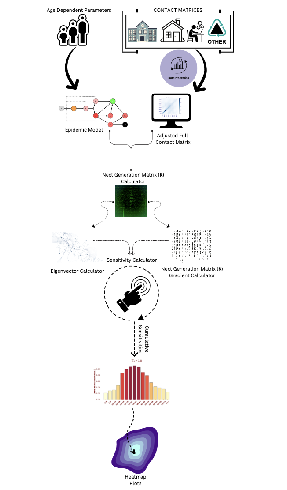

# Eigenvector-Based Sensitivity Analysis of Contact Patterns in Epidemic Modeling. 

## Introduction
This repository explores age-related variations in virus transmission through perturbation analysis of the 
Next Generation Matrix (NGM) within an age-structured epidemic model. By solving a linear eigen-problem and 
analyzing how the basic reproduction number,R<sub>0</sub>, responds to change in the contact matrix, 
we compute gradients that help identify critical age-specific contact behaviors and susceptibility factors.

## Key Investigation
- **NGM Analysis**: Assessing the impact of perturbations in the contact matrix on the Next Generation Matrix (NGM).

## Data Files
```
data: stored in the Google drive; "https://drive.google.com/uc?id=18ztwRVy4qW2NMs8OKUbkEDS_1rAxpRt0"
  ├── age_distribution       # Population data for each age group used in the model.
  ├── contact_matrices       # Contact matrices for various settings: Home, School, Work, and Other.
  └── model_parameters       # JSON files containing model parameters.
```

## Target Investigated
- **R0 (Basic Reproduction Number)**
  - **Description**: Represents the average number of secondary infections caused by one infected individual in a 
  completely susceptible population.
  
## Method
A summary about the steps of the research project:


## Folder Structure
```
data                
src                    
 ├── comp_graph        
 │   ├── cm_creator      
 │   └── cm_elements_cg_leaf      
 ├── gradient        
 │   ├── eigen_value_gradient    
 │   ├── ngm_gradient  
 │   └── sensitivity_calculator
 ├── models       
 │   ├── british_columbia 
 │   │   ├── model 
 │   │   ├── ngm_calculator  
 │   │   └── v_matrix_calculator
 │   ├── chikina 
 │   │   ├── model
 │   │   ├── ngm_calculator  
 │   │   └── v_matrix_calculator
 │   ├── italy   
 │   │   ├── ngm_calculator  
 │   │   └── v_matrix_calculator
 │   ├── kenya 
 │   │   ├── model
 │   │   ├── ngm_calculator  
 │   │   └── v_matrix_calculator
 │   ├── moghadas
 │   │   ├── model
 │   │   ├── ngm_calculator  
 │   │   └── v_matrix_calculator
 │   ├── rost
 │   │   ├── model
 │   │   ├── ngm_calculator  
 │   │   └── v_matrix_calculator
 │   └── seir 
 │       ├── model
 │       ├── ngm_calculator  
 │       └── v_matrix_calculator
 ├── static 
 │   ├── cm
 │   │   ├── cm_data
 │   │   ├── cm_data_aggregate_kenya
 │   │   └── cm_leaf_preparatory 
 │   ├── model
 │   │   ├── e_matrix_calculator
 │   │   ├── ngm_calculator_base 
 │   │   └── v_matrix_calculator_base
 │   ├── dataloader     
 │   └── eigen_calculator
 ├── aggregation  
 ├── plotter               
 └── runner
main 
README
```

## File Details
#### `src/comp_graph/`
- **`cm_creator.py`**: Multiplies the contact matrix by either contact_matrix_sum or population_sum to obtain 
cm_elements. It then computes a symmetric contact matrix from these elements and normalizes it by the population.
- **`cm_elements_cg_leaf.py`**: Designed to handle and process contact matrices in the context of population data.
by extracting the upper triangular elements from the transformed total contact matrix.

#### `src/gradient/`
- **`eigen_value_gradient.py`**: 
- **`ngm_gradient.py`**: Calculates the gradient of the NGM with small domain with respect to the upper triangular 
elements.
- **`sensitivity_calculator.py`**: Initializes and loads data, creates the computation graph leaf, manipulates the 
contact matrix, and computes both the eigenvalue and gradient.

#### `src/models/`
- **`model.py`**: Implements the model equations for each model  
- **`ngm_calculator.py`**: Computes the NGM with small domain for each model assuming susceptibility values of [0.5, 1.0].
- **`v_matrix_calculator.py`**: Constructs and inverts a transition matrix based on given parameters for each model.

#### `src/static/`
- **`cm/cm_data.py`**: Loads and calculates the sum of contact matrices in different settings from the `dataloader.py`.
- **`cm/cm_data_aggregate_kenya.py`**: Loads the data corresponding to kenya model and aggregates it into 4 age groups
- **`cm/cm_leaf_preparatory.py`**: Transforms the given full contact matrix obtained from the `cm_data.py`.
- **`model/e_matrix_calculator.py`**: Designed to create a block diagonal matrix with specific properties.
- **`model/ngm_calculator_base.py`**: Base class for computing the NGM with small domain for each model.
- **`model/v_matrix_calculator_base.py`**: Base class for constructing and inverting a transition matrix based 
on given parameters.
- **`dataloader.py`**: Designed to load and preprocess data required for the project.
- **`eigen_calculator.py`**: Computes the dominant eigenvalue and the corresponding eigenvector of the NGM with 
small domain matrix.
- **`model_base.py`**: Base class for implementing the model equations

#### `src/`
- **`aggregation.py`**: Applies the concept of cumulatives to get cumulative sensitivities as an aggregation approach.
- **`plotter.py`**: Generates a triangular heatmap to visualize contact inputs. It also plots a heatmap of a given 
matrix and reconstructs a symmetric matrix from the gradient values, which are initially represented as 
just the upper triangular elements.
- **`runner.py`**: Handles data loading and initialization, setting up parameters and age groups for simulations. 
It iterates over different scales and susceptibility values to update model parameters and generate 
gradient-related plots.
- **`main.py`**: Imports and initializes DataLoader to load simulation data, then imports Runner, initializes it, and
run the simulations.

## Implementation

To run the simulation, follow these steps:
1. Open `main.py` and configure the simulation parameters. 
2. Run the simulation with these steps:
#### Specify the model for the simulation e.g
``` model = "rost" ```
#### Load the necessary data for the simulation
```data = DataLoader(model=model) ``` 
#### Initialize the Runner with the loaded data
``` runner = Runner(data=data, model=model)  ```
#### Start the simulation
```runner.run() ```

## Output
```
generated/model
     ├── CM
     │    └── CM.pdf # Visualizes the symmetric contact input as matrix using the selected scaling.    
     ├── contact_matrices
     │    └── contact_matrices.pdf # Visualizes the contact matrices at Home, School, Work, Other, and Full.
     ├── results_base_r0_susc
     │    ├── cum_sens.pdf # Shows the cumulative sensitivity heatmap    
     │    └──  Grads_tri.pdf # Shows the gradients with different base R0s and susc as upper tri elements.
```

## Requirement
This project is developed and tested with Python 3.8 or higher. Install dependencies from `requirements.txt`:
```bash
pip install -r requirements.txt
